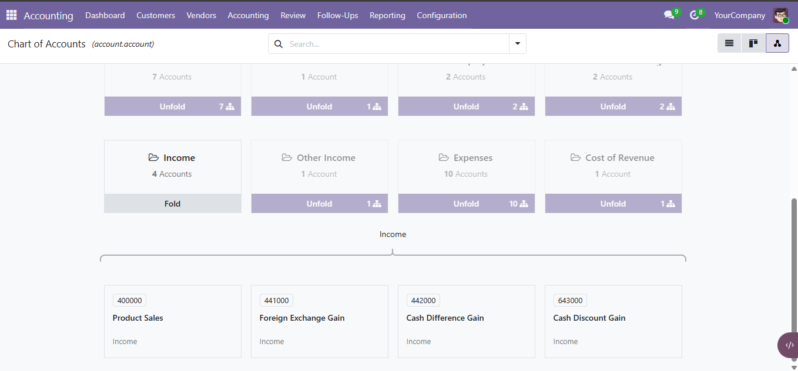

# Chart of Accounts Hierarchy for Odoo

A native hierarchy view for the Odoo Chart of Accounts.

The module adds an optional **Hierarchy** view to the standard Chart of Accounts and groups accounts by their account type.

The normal Odoo Chart of Accounts behavior remains unchanged: the List view stays the default view, while Hierarchy is added as an additional view.

## Supported Version

- Odoo 19.0

Support for older Odoo versions may be added later.

## Features

- Native Odoo `web_hierarchy` integration
- Account Type → Account hierarchy
- Fold and unfold account types
- Open real `account.account` records directly from the hierarchy
- Standard Chart of Accounts search support
- Standard filters and search panel support
- Multi-company support
- Company-dependent account codes
- Inactive account support
- Lazy loading of account records
- No changes to accounting data or account relationships
- No drag-and-drop accounting changes
- Backend regression tests
- Frontend HOOT regression tests

## Hierarchy Structure

The current hierarchy contains two levels:

```text
Account Type
    ├── Account
    ├── Account
    └── Account
```

Example:

```text
Income
    ├── 400000 Product Sales
    ├── 401000 Consulting Services
    └── 402000 Other Revenue

Expenses
    ├── 600000 Salaries
    ├── 601000 Rent
    └── 602000 Utilities
```

Account Type nodes are virtual hierarchy nodes used only for visualization.

The accounts below them are real `account.account` records.

## Screenshot



## Odoo Integration

The module extends the existing Chart of Accounts action.

Default Odoo behavior:

```text
List
Kanban
Form
```

With this module:

```text
List
Kanban
Form
Hierarchy
```

The List view remains the default.

## Technical Approach

Odoo's standard hierarchy view expects a self-referencing model structure.

However, `account.account.account_type` is a Selection field rather than a parent model.

This module keeps `account.account` as the actual hierarchy model and creates virtual Account Type nodes in the custom hierarchy model.

Real account records are lazy-loaded when an Account Type is unfolded.

This allows the module to reuse Odoo's native `web_hierarchy` infrastructure without creating fake accounting records.

## Installation

Clone the repository:

```bash
git clone https://github.com/Gadero5565/account-coa-hierarchy.git
```

The actual Odoo addon is located at:

```text
account_coa_hierarchy/account_coa_hierarchy/
```

Make sure the parent directory is available in your Odoo addons path.

Then update the Apps list and install:

```text
Chart of Accounts Hierarchy
```

Technical module name:

```text
account_coa_hierarchy
```

## Dependencies

- `account`
- `web_hierarchy`

## Usage

Open:

```text
Accounting → Configuration → Chart of Accounts
```

Then select the **Hierarchy** view from the view switcher.

Account Type cards can be folded and unfolded.

Clicking an account card opens the normal Odoo account form.

## Multi-Company

The hierarchy follows the same account visibility, company context, domains, and access rules as the standard Chart of Accounts.

Odoo 19 company-dependent account codes are supported through Odoo's standard account code placeholder behavior.

## Inactive Accounts

The standard **Inactive Accounts** filter is supported.

Inactive accounts are correctly lazy-loaded when their Account Type is unfolded.

## Tests

### Backend Tests

Run:

```bash
python odoo-bin \
    -c /path/to/odoo.conf \
    -d DATABASE_NAME \
    -u account_coa_hierarchy \
    --test-tags="/account_coa_hierarchy" \
    --stop-after-init \
    --log-level=test
```

The backend suite covers:

- Account Type grouping
- Domain filtering
- Empty Account Type handling
- Virtual hierarchy roots
- Inactive accounts
- Default active account behavior
- Preservation of the standard Chart of Accounts default view

### Frontend Tests

Odoo HOOT tests are available through:

```text
/web/tests
```

The frontend suite covers:

- Active account unfolding
- Inactive account unfolding
- Hierarchy reload after search-domain changes
- Virtual Account Type navigation
- Real account record navigation

## Current Status

Odoo 19 implementation is functionally complete and being prepared for its first stable release.

## Roadmap

Possible future improvements include:

- Odoo 18 support
- Odoo 17 support
- Odoo 16 investigation
- Optional Account Group hierarchy level
- Additional account hierarchy visualization options

## License

GNU Lesser General Public License v3.0 — LGPL-3.0.

## Author

**Gadeer Mahmoud**

GitHub: `Gadero5565`